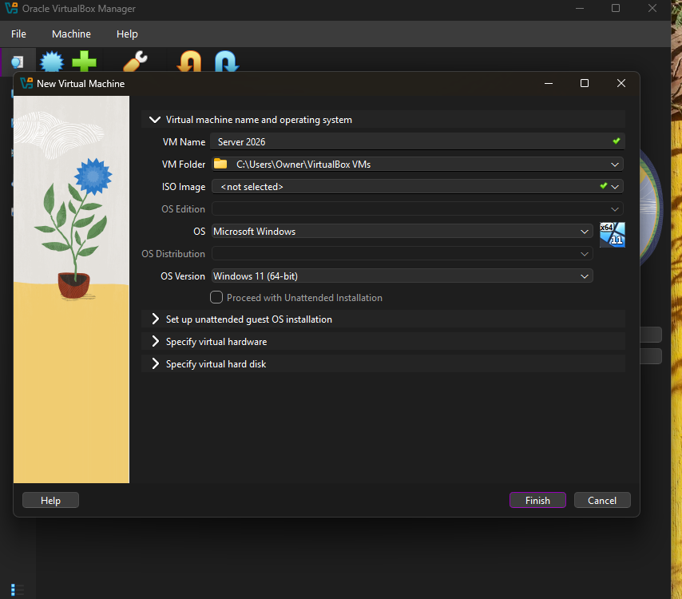
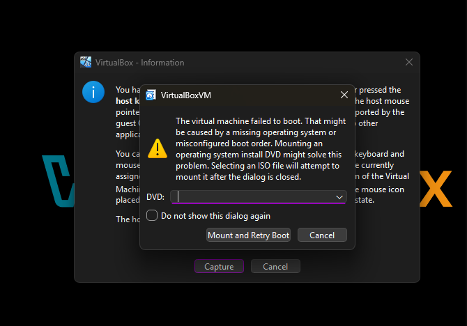
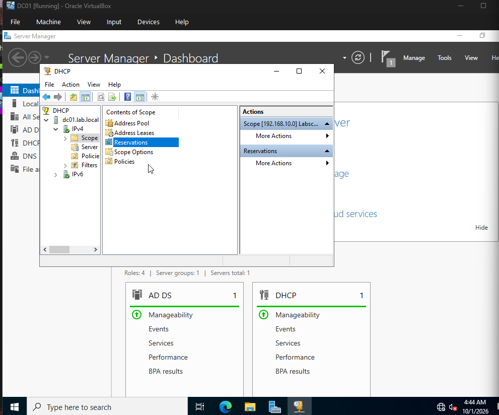
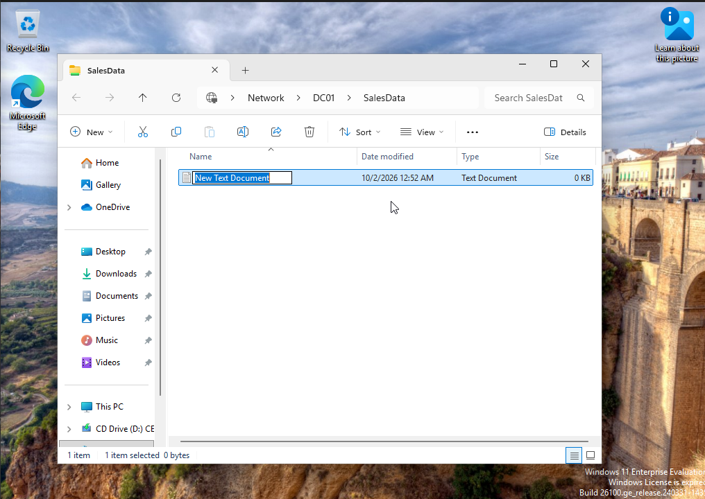

# IT Help Desk Home Lab

A virtual company network built in VirtualBox to practice help desk and Windows administration tasks: Active Directory, DNS, DHCP, group-based file permissions, and troubleshooting.

**Author:** Anawar Kimo

## Environment

| Item | Details |
|---|---|
| Hypervisor | Oracle VirtualBox |
| Server | Windows Server 2022 Standard Evaluation (Desktop Experience), hostname `DC01` |
| Client | Windows 11 Enterprise Evaluation, hostname `PC01` |
| Domain | `lab.local` |
| Server roles | AD DS, DNS, DHCP |

Both operating systems are Microsoft evaluation builds from the Microsoft Evaluation Center.

## Network design

| Setting | Value |
|---|---|
| Lab network | VirtualBox Internal Network `labnet` |
| DC01 (labnet adapter) | `192.168.10.10` / `255.255.255.0`, DNS `192.168.10.10`, no gateway |
| DHCP scope | `192.168.10.100` – `192.168.10.200` |
| Client | Gets its address from DC01's DHCP server |

DC01 has a second adapter on NAT for internet access. PC01 is only on `labnet`, so it can reach DC01 but not the internet.

## What I built

### Phase 1: Domain and client
1. Created the DC01 VM and installed Windows Server 2022 with Desktop Experience.
2. Renamed the server and set a static IP on the `labnet` adapter.
3. Installed AD DS, DNS, and DHCP, and promoted DC01 to a domain controller for a new forest, `lab.local`.
4. Created and activated a DHCP scope.
5. Built the PC01 VM (Windows 11 with EFI, Secure Boot, and TPM 2.0 enabled), confirmed it received a DHCP address, and joined it to `lab.local`.
6. Created a test user and signed in to the domain from PC01.

### Phase 2: Users, groups, and shared folder
1. Created OUs: `Help desk` and `Sales`.
2. Created users `patsales` (Sales) and `samhelper` (Help desk) and a security group `Sales-Staff`, with `patsales` as a member.
3. Created the folder `C:\Shares\Salesdata`, shared it as `SalesData` with share permissions set to Everyone: Full Control, and restricted access with NTFS permissions so only `Sales-Staff` (Modify), Administrators, and SYSTEM have access.
4. Tested from PC01:
   - `patsales` can open `\\DC01\SalesData` and create files.
   - `samhelper` is denied access.

## Troubleshooting log

| Problem | Cause | Fix |
|---|---|---|
| VirtualBox reported the VM failed to boot | No operating system or boot media was attached to the new VM, so there was nothing to boot from | Attached the Windows installation ISO to the VM's optical drive and started the install |
| PC01 got a `169.254.x.x` address and no network | DC01's labnet adapter had no static IP applied, so the DHCP server had no valid address on the network | Set `192.168.10.10` on DC01's labnet adapter, restarted the DHCP service, ran `ipconfig /renew` on PC01 |
| `\\DC01\SalesData` returned a network error even though ping worked | The folder was never shared; the Advanced Sharing window had not been saved. `net share` did not list `SalesData` | Saved the share with the name `SalesData` and set share permissions |
| `patsales` could open the folder but not create files | `Sales-Staff` had no members, so `patsales` had no Modify permission | Added `patsales` to the group and signed out and back in so the new membership applied |
| `samhelper` could open the folder when he should have been blocked | The inherited `Users` entry on the folder still granted Read & execute to all domain users | Removed the `Users` entry from the folder's NTFS permissions and retested as `samhelper` (access denied) |
| Could not add a user to the group | Typo in the user name (`patsaless`) | Corrected the logon name and used Check Names |

## Skills demonstrated

- Installing and configuring Windows Server 2022 as a domain controller
- Active Directory: OUs, users, security groups, domain join
- DNS and DHCP setup and troubleshooting (`ipconfig /renew`, `ping`, `nslookup`, `net share`)
- NTFS and share permissions, and testing access as different users
- Systematic troubleshooting: isolate the layer (network, name resolution, share, permissions), fix, and verify

## Screenshots

### VM setup

*Creating a virtual machine in VirtualBox.*

*VirtualBox reported that the VM failed to boot because no operating system or boot media was attached. See the troubleshooting log.*

### DHCP

*DHCP scope for 192.168.10.0 configured on DC01 (lab.local).*

### Shared folder access

*patsales, a member of Sales-Staff, creating a file in the `\\DC01\SalesData` share.*

More screenshots to add in the `screenshots/` folder:

- PC01 `ipconfig` showing a 192.168.10.x address (`screenshots/pc01-ipconfig.png`)
- Active Directory OUs and Sales-Staff members (`screenshots/ad-ous-and-group.png`)
- SalesData folder Security tab (`screenshots/salesdata-security-tab.png`)
- samhelper access denied (`screenshots/samhelper-denied.png`)

## Planned next

- Password resets and account unlock practice
- Disabling and re-enabling accounts
- Group Policy (automatic drive mapping)
- A ticketing tool to log each fix
